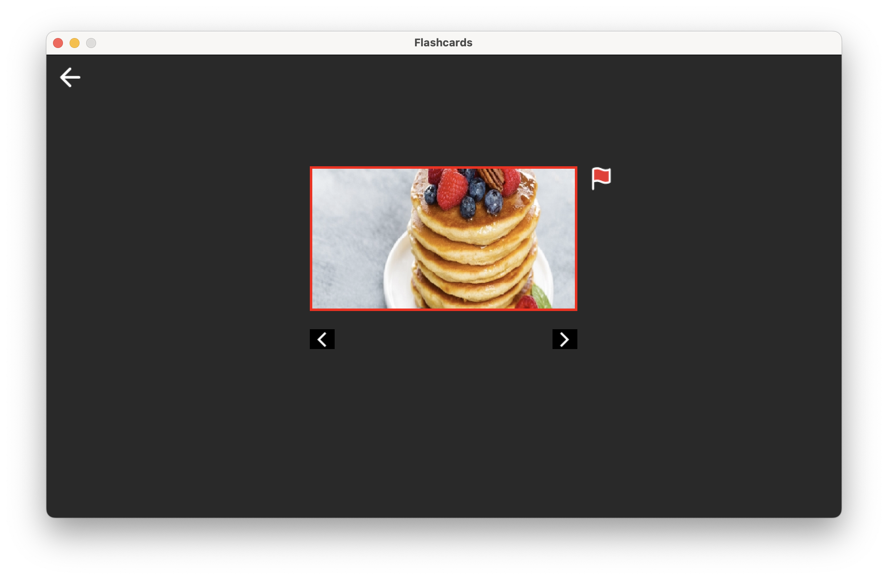
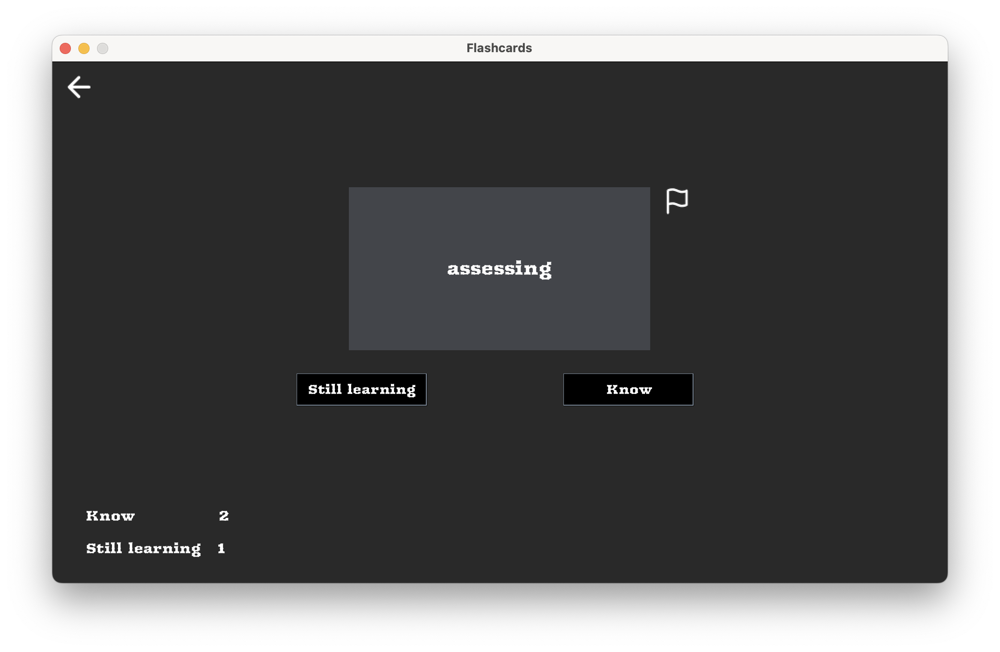
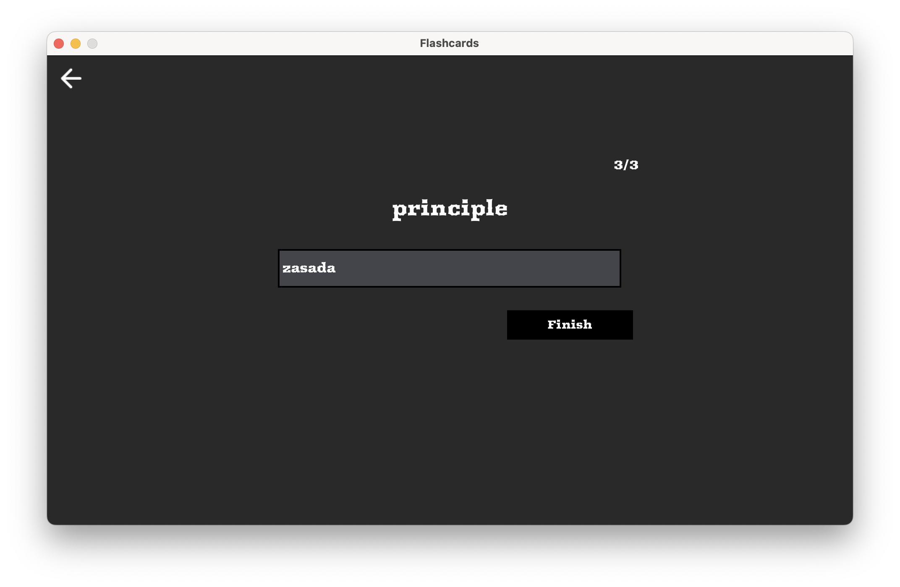

<p align="center">
   <a href="https://github.com/kjzieba/Flashcards">
     
   </a>
</p>


### Setup

1. Make sure you have `Java 17` and `Maven` installed on your machine.
2. Clone the repository.
```bash
git clone https://github.com/kjzieba/Flashcards.git
```
3. Open terminal in the project directory and run the following command:
```bash
./exec.sh
```

### Features

Desktop application to learning new words. It allows you to create your own repository of words, phrases and images.
You can choose from 3 modes of learning: 
- `Flashcards`
- `Learn`
- `Test` 

Project uses design patterns such as:
- `Singleton`
- `Factory method`
- `Facade`
- `Observer`
- `Proxy`
- `Iterator`
- `Command`
- `Memento`
- `State`

### Screenshots
<p align="center">
   <a href="https://github.com/kjzieba/Flashcards">
     
   </a>
</p>

<p align="center">
   <a href="https://github.com/kjzieba/Flashcards">
     
   </a>
</p>

<p align="center">
   <a href="https://github.com/kjzieba/Flashcards">
     
   </a>
</p>


